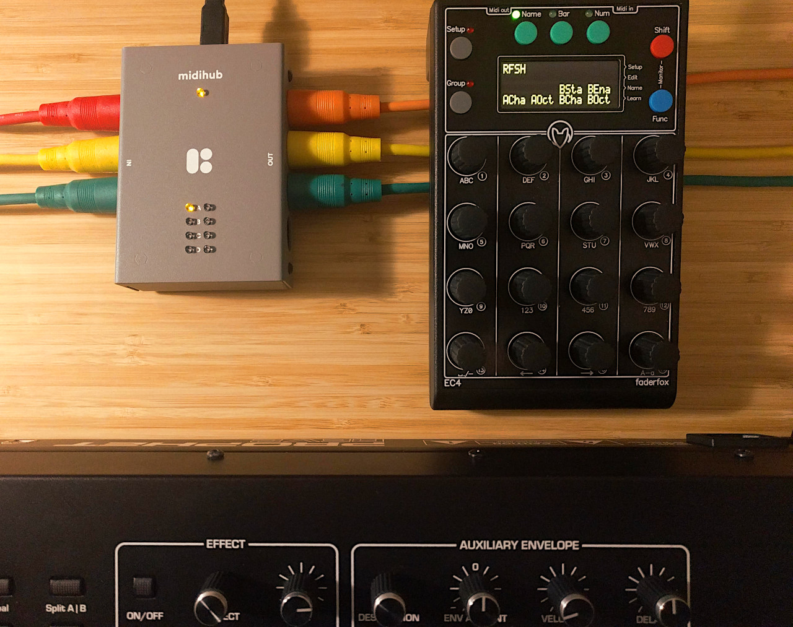

The [Prophet Rev2](https://www.sequential.com/product/prophetrev2/) is a polyphonic analog synthesizer, paired with a 5-octave *[keybed](https://www.sweetwater.com/insync/keybed/)*. It also has modulation and pitch wheels, and inputs for expression and sustain pedals. For these reasons, it's a common scenario to use it to control other devices, via MIDI. However, since it wasn't designed to be used as master MIDI keyboard, it falls short in a [variety of ways](#rev2-limitations).

This project is the culmination of my quest of working around these limitations so that the Rev2 can be used as a fully-featured master MIDI keyboard.

---

# Table of Contents
1. [Setup Instructions](setup.md)
1. [How it Works](how.md)
1. [Summary of Features](#features)
1. [Zones](#zones)
1. [Control Plane](#control-plane)
1. [Rev2 Limitations](#rev2-limitations)

# Features

- Use the Rev2 as if it were two independent devices: a **Keyboard** and a **Synth**
- **Keyboard** outputs on **MIDI OUT A**
    - Note On
    - Note Off
    - Modulation Wheel
    - Pitch Wheel
    - Channel Pressure (*Aftertouch*)
    - Expression Pedal
    - Sustain Pedal
- **Synth** outputs on **MIDI OUT C**
    - CC (NRPN)
    - Clock
    - Program Change
- **Knobs** operate as if `Local control` would be `On`
- [**Keyboard zones**](#zones)
    - **Keyboard** can be split into **zones A and B**, which are independent of the **Synth**'s layers
    - **Zones** can be assigned to different MIDI channels, independently of the channels the **Synth** operates on
    - **Zones** can be transposed independently, e.g. transpose zone A by -2 octaves, and zone B by +1 octave
- **Keyboard** can be [controlled](#control-plane) through MIDI CC on **MIDI INPUT A**, e.g. **Zone** split point
- **Synth** accepts MIDI input on **MIDI INPUT C**

# Zones
> This section is yet to be written.

# Control plane
> This section is currently being improved.

Input A, channel 16.

- CC 1: Zone A output channel
    - Valid values: 1 to 16
    - 0 is interpreted as 1
    - Values greater than 16 are interpreted as 16
- CC 2: Zone B output channel
    - Valid values: 1 to 16
    - 0 is interpreted as 1
    - Values greater than 16 are interpreted as 16
- CC 3: Zone A transpose
    - Bipolar (-64 to +63)
- CC 4: Zone B transpose
    - Bipolar (-64 to +63)
- CC 5: Zone B start key
    - Bipolar (-64 to +63)

# Rev2 limitations
This section documents some of the Rev2's limitations.

## No hybrid Local Control mode

## LFO and other parameters not sent in CC mode
With `Local Control` set to `Off` and `MIDI Param Send` set to `CC`, for many of the Rev2's parameters, no MIDI message is triggered when the parameter changes. This is because there are more than 127 parameters in the Rev2. Setting `MIDI Param Send` to `NRPN` fixes this issue.

## Program Change in Multimode
With `Local Control` set to `Off`, and `Multimode` set to `On`, Program Change messages triggered by the Program and Bank knobs are only sent to Layer A's MIDI channel, i.e. they aren't duplicated to Layer B's MIDI channel. In a setting where these messages are re-routed back to the Rev2, this causes Layer A's Program to change, while Layer B's Program remains unchanged.
