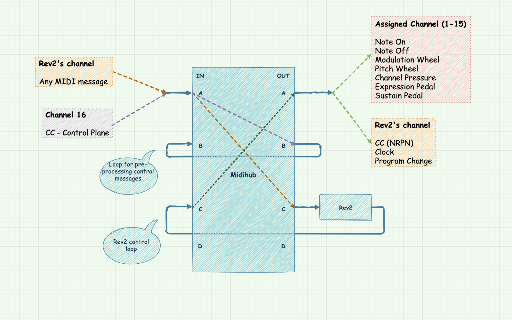

# rev2-master-keyboard

The [Prophet Rev2](https://www.sequential.com/product/prophetrev2/) is a fantastic polyphonic analog synthesizer, paired with a very capable 5-octave *[keybed](https://www.sweetwater.com/insync/keybed/)*. It also has modulation and pitch wheels, and inputs for expression and sustain pedals. For these reasons, it's a common scenario to use it to control other devices, via MIDI. However, since it wasn't designed to be used as master MIDI keyboard, it falls short in a [variety of ways](#rev2-limitations). This project is the culmination of my quest of working around these limitations so that the Rev2 can be used to play other devices in my home studio.

## Features
TODO

- the knobs on the device's panel control the device itself, while the keyboard can be "routed" to any synthesizer, including the Rev2 iself.

## How it works

In essence, a [Midihub](https://blokas.io/midihub/) hardware MIDI processor is used to "split" the Rev2 into two logical devices:

- a synthesizer with a MIDI input and a MIDI output
- a keyboard with a MIDI input and a MIDI output

## Setup
For setup instructions go [here](setup.md).

## Rev2 limitations
TODO

## Control plane
Input A, channel 16.

- CC 1: Split A output channel
    - Valid values: 1 to 16
    - 0 is interpreted as 1
    - Values greater than 16 are interpreted as 16
- CC 2: Split B output channel
    - Valid values: 1 to 16
    - 0 is interpreted as 1
    - Values greater than 16 are interpreted as 16
- CC 3: Zone A transpose
    - Bipolar (-64 to +63)
- CC 4: Zone B transpose
    - Bipolar (-64 to +63)
- CC 5: Zone B start key
    - Bipolar (-64 to +63)

