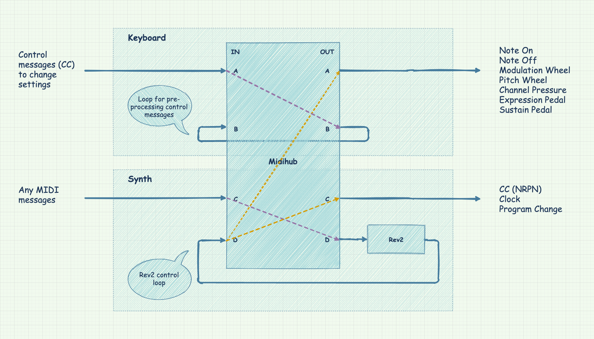

# Setup Instructions
> Make sure you follow all instructions in this document, until the end.

## Set Rev2's global settings
The first thing to do is to make sure the Rev2's global settings are correctly set:

- MIDI Channel: 1 (See also: [changing the Rev2's MIDI channel](#changing-the-rev2s-midi-channel))
- MIDI Param Send: NRPN
- MIDI Param Rcv: NRPN
- MIDI Control: On
- MIDI Program Enable: On
- MIDI Program Send: On
- MIDI Out Select: MIDI
- Local Control :Off

## Connect MIDI cables
The next step is to connect all the MIDI cables (see image below for a visual aid):

- From Midihub's `OUT C` to Rev2's `IN`
- From Rev2's `OUT` to Midihub's `IN C`
- From Midihub's `OUT B` to Midihub's `IN B`.
- From Midihub's `OUT A` to a MIDI interface or MIDI thru box, depending on your setup.
- (Optional) From a MIDI interface, sequencer, or MIDI controller's `OUT` to Midihub's `IN A`.

## Install Midihub's editor
You'll need the Midihub's Editor to install the patch. Download and install the editor for your operating system:

- [Windows](https://blokas.io/midihub/downloads/latest/windows/)
- [MacOS](https://blokas.io/midihub/downloads/latest/mac/)
- [Linux](https://blokas.io/midihub/downloads/latest/linux/)
- [Raspberry Pi](https://blokas.io/midihub/downloads/latest/linux_arm/)

## Install Midihub's patch

1. Download the [latest version of the patch](https://github.com/psrpinto/rev2-master-keyboard/releases), then extract the zipfile.
2. Connect the Midihub to your computer through USB, and open the Midihub Editor that you installed in the previous step.
3. Click the `Connect` button, then go to `File -> Open` and open `midihub.mhp` in the files extracted from the zip.
4. Then click the button with the down arrow on top left of the Editor, and `Store to current preset` (or to whatever preset you wish).
5. Click the `Disconnect` button
6. (optional) Disconnect the Midihub from your computer.

## Change the Rev2's MIDI channel
> This is an optional step. If you wish to keep the Rev2 set to channels 1 and 2, skip this step.

The Rev2's factory default for Layer A's MIDI channel is channel `1` (which implicitly sets Layer B's MIDI channel to `2`, when Multimode is `On`). We use the same default internally in the Midihub's patch. If you wish to change this default, you must set the channel in the Rev2's global settings, then edit the Midihub's patch accordingly.

You'll need to change the patch in two places.

Locate the following _pipe_, then click the `CH FILTER` block, and make it so that only the Rev2's channel is **not** selected. E.g, if you set the channel in the Rev2's Global Settings to be 7, all channels but 7 should be selected.

Then locate the following pipe, click the `CH REMAP` block, and make it so that:

- `In Low` and `In High` are set to the Rev2's channel (e.g. 7 from the example above)
- `Out Low` and `Out High` are set to one channel above the Rev2's (e.g. 8)

## Setup done!
See [usage instructions](README.md#usage).